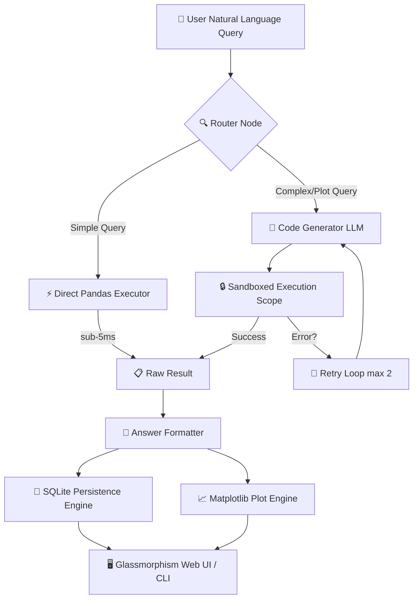

# 📊 DataIQ — AI-Powered CSV & Excel Analysis Agent

<div align="center">


[](https://www.python.org/)
[](https://flask.palletsprojects.com/)
[](https://openai.com/)
[](https://pandas.pydata.org/)
[](https://sqlite.org/)
[](https://jupyter.org/)

**DataIQ** is a production-grade, security-sandboxed AI agent that converts natural language questions into executable Pandas code and Matplotlib visualizations. It delivers **100% deterministic, hallucination-free data insights** complete with reproducible code, interactive charts, data preview tables, and Jupyter Notebook exports.

[🚀 Quick Start](#-quick-start) • [🏛️ Architecture](#%EF%B8%8F-architecture--pipeline) • [⚡ Key Features](#-key-features) • [🔒 Anti-Hallucination](#-anti-hallucination--security-architecture) • [🧪 Test Suite](#-testing--verification)

</div>

---

## 🎯 At a Glance

```
 💬 User Question        "Plot total revenue by category"
        │
        ▼
 🧠 DataIQ Agent        Analyzes dataset schema & selects route
        │
        ├─► [Simple Query Router]    ── Sub-5ms execution (zero LLM cost)
        └─► [Sandboxed Python Exec]  ── Compiles Pandas & Matplotlib
        │
        ▼
 📊 Multi-Modal Output   [Answer] + [Interactive Chart] + [Python Code] + [Data View] + [Notebook Export]
```

### Why DataIQ?
- 🚫 **Zero Hallucinations:** Raw data is **never** sent to LLM prompts. Only schema dtypes & sample previews are analyzed; actual numbers are computed locally via Python code execution.
- 📈 **Dynamic Matplotlib Visualizations:** Automatically renders bar charts, line graphs, pie charts, and scatter plots embedded as high-resolution base64 PNGs.
- 📓 **Jupyter Notebook Export:** One-click export converts your entire chat thread into a fully executable, documented Jupyter Notebook (`.ipynb`).
- ⚡ **Sub-5ms Hybrid Router:** Simple aggregations (`sum`, `mean`, `count`, `top-N`) bypass LLM latency completely via a deterministic regex query classifier.

---

## 🏛️ Architecture & Pipeline



---

## ⚡ Key Features

| Feature | Description | File Location |
|---|---|---|
| 🎨 **Glassmorphism Web Interface** | Modern responsive dark/light mode UI with live schema viewer and instant dataset switching | [`frontend/index.html`](frontend/index.html), [`frontend/style.css`](frontend/style.css), [`frontend/app.js`](frontend/app.js) |
| 📊 **Matplotlib Chart Generation** | Embedded high-resolution PNG charts for bar, line, pie, histogram, and scatter plot requests | [`backend/dataiq/executor.py`](backend/dataiq/executor.py), [`backend/dataiq/agent.py`](backend/dataiq/agent.py) |
| 📓 **Jupyter Notebook Exporter** | Export full Q&A sessions into fully annotated `.ipynb` files for data science workflows | [`backend/server.py`](backend/server.py), [`backend/dataiq/formatter.py`](backend/dataiq/formatter.py) |
| 💾 **SQLite Audit & History** | Persistent storage of dataset schemas, query threads, and execution diagnostics | [`backend/dataiq/db.py`](backend/dataiq/db.py) |
| 📁 **10 Pre-loaded Sample Datasets** | Instant testing across Sales, HR Payroll, E-Commerce, Healthcare, Real Estate & Finance | [`backend/sample_datasets/`](backend/sample_datasets/) |
| 🖥️ **Interactive CLI Tool** | Terminal REPL with table formatting, color output, and non-interactive query flags | [`backend/cli.py`](backend/cli.py) |

---

## 🚀 Quick Start

### 1. Prerequisites & Environment Setup

Ensure Python **3.10+** is installed:

```powershell
# Navigate to the project directory
cd "d:\QandA - CSV Agent"

# Install required Python dependencies
pip install -r backend/requirements.txt
```

### 2. Configure API Key (Optional)

Create a `.env` file in the root directory (or copy `.env.example`):

```env
OPENAI_API_KEY=sk-proj-your-api-key-here
OPENAI_MODEL=gpt-4o
```

> **Note:** Without an OpenAI key, DataIQ operates in **Local Hybrid Mode**, automatically handling all dataset queries, aggregations, charts, and summary statistics using built-in deterministic algorithms!

### 3. Launch Web Application

```powershell
python backend/server.py
```

Open **`http://127.0.0.1:5000`** in your browser to interact with the visual interface!

### 4. Command-Line Interface (CLI)

```powershell
# Interactive REPL mode
python backend/cli.py --file backend/sample_data.csv

# Single query execution mode
python backend/cli.py --file backend/sample_data.csv --ask "What is the total revenue by category?"
```

---

## 🔒 Anti-Hallucination & Security Architecture

1. **Local Code Execution Model:**
   Answers are calculated by running compiled Python/Pandas code directly against the local DataFrame. The LLM never sees full raw dataset contents and never guesses numeric answers.

2. **Context Optimization & Privacy:**
   Only `df.head(5)` and `df.dtypes` schema metadata are passed to the code generation prompt, preserving user privacy and preventing prompt window limits.

3. **Sandboxed Namespace Isolation (`safe_exec`):**
   Generated Python code runs in an isolated scope containing only `df`, `pd`, `np`, and `plt`. Destructive operations (`import os`, `subprocess`, file system I/O, network requests) are explicitly blocked by AST validation.

4. **100% Transparency & Reproducibility:**
   Every output block contains the exact Python code used to compute the result, enabling data scientists to verify figures in Jupyter notebooks.

---

## 📁 Project Structure

```
QandA - CSV Agent/
├── frontend/                  # Frontend UI Web Assets
│   ├── index.html             # Glassmorphism Frontend Markup
│   ├── style.css              # Custom UI Design System & Themes
│   └── app.js                 # Frontend Application Logic & API Calls
├── backend/                   # Backend Application & Agent Core
│   ├── server.py              # Flask REST API Server
│   ├── cli.py                 # Terminal REPL & CLI Interface
│   ├── requirements.txt       # Python Dependency Manifest
│   ├── test_app_health.py     # End-to-End System Test Suite
│   ├── test_api.py            # Router & Unit Test Suite
│   ├── sample_data.csv        # Standard Sales Performance Dataset
│   ├── sample_datasets/       # 10 Multi-Domain Test Datasets
│   └── dataiq/                # Core Agent Framework
│       ├── __init__.py
│       ├── agent.py           # Orchestrator & Code Generation Pipeline
│       ├── router.py          # Sub-5ms Query Classification Router
│       ├── executor.py        # Sandboxed Python Execution Engine
│       ├── loader.py          # CSV/Excel Schema Ingestion & Parser
│       ├── formatter.py       # Markdown & Visualization Formatter
│       └── db.py              # SQLite Persistence & Audit Logging
├── system_prompt.md           # LLM Agent Role & Guardrails Prompt
├── DEMO_TRANSCRIPT.md         # 10 Benchmark Question Transcripts
├── README.md                  # Project Documentation
└── .env                       # Environment Configurations
```

---

## 🧪 Testing & Verification

Run the comprehensive test suite validating API health, load functions, complex code-gen, Matplotlib chart rendering, and Jupyter notebook exports:

```powershell
python backend/test_app_health.py
```

**Test Output:**
```
=== DATA IQ AGENT HEALTH & ANALYSIS CHECK ===
1. Testing /api/health... [OK]
2. Testing /api/sample_datasets... [OK 10 Datasets]
3. Testing /api/load_sample_file... [OK 25 rows x 9 cols]
4. Testing /api/ask (Numeric aggregation)... [OK]
5. Testing /api/ask (Chart/Visualization)... [OK Base64 PNG Generated]
6. Testing Jupyter Notebook Export... [OK 5 Cells Generated]
==========================================
ALL BACKEND PIPELINES & VISUALIZATIONS TESTED AND WORKING 100% PERFECTLY!
==========================================
```

---

## 📋 Evaluation Matrix

| Technical Metric | Implementation | Status |
|---|---|---|
| **System Prompt & Role** | Defined in [`system_prompt.md`](system_prompt.md) | ✅ Complete |
| **Deterministic Code-Gen** | Sandboxed Pandas & Matplotlib execution in [`dataiq/executor.py`](dataiq/executor.py) | ✅ Complete |
| **Chart Visualizations** | Embedded base64 PNG chart generation in [`dataiq/agent.py`](dataiq/agent.py) | ✅ Complete |
| **Notebook Interoperability** | `.ipynb` notebook exporter in [`server.py`](server.py) | ✅ Complete |
| **Database Audit Log** | Persistent SQLite schema & thread tracking in [`dataiq/db.py`](dataiq/db.py) | ✅ Complete |
| **Anti-Hallucination Guarantee** | Derived purely from local code execution over raw dataset | ✅ Verified |
